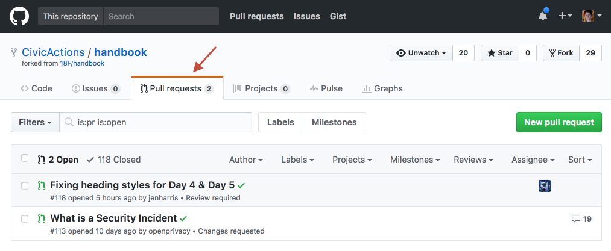
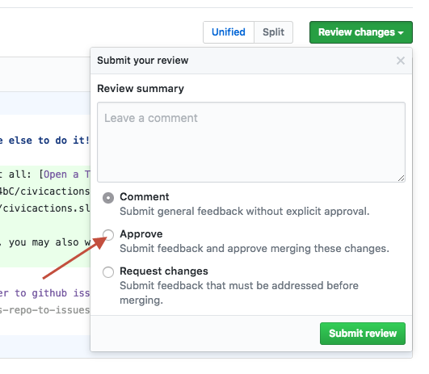

# How to update the handbook

## The lazy way (get someone else to do it!)

Better than doing nothing at all: [Open a Trello card](https://trello.com/b/ZKx6l4bC/civicactions-documentation-project) with a suggestion, or chat about it in [#docs](https://civicactions.slack.com/messages/docs/).

If you choose this approach, you may also wish to let someone in the documentation working group know about your suggestion!

> @todo [Update this to refer to github issues once we switch](https://trello.com/c/Kxf3ER8i/98-move-issue-tracking-for-this-repo-to-issues)

## The easy way, via the github UI on the master branch

We only recommend this approach for those who are not already familiar with the git workflow, and who do not have tools for keeping their github forks up to date.

You'll need a Github account, and to be added to the CivicActions Team ([instructions are here](docs/04-how-we-work/tools/github.md)).

Go to a page, click edit, and make your changes, using [markdown](https://guides.github.com/features/mastering-markdown/).  Before you commit your changes, click the "Preview changes" tab to make sure your formatting is good and everything looks right.

When you save it ("make a commit"), there are three fields to fill out. *All of these are optional*, with default values, and in most cases it's fine to leave the defaults.

* **The commit title**: By default it is something like "Update \[filename]". You can usually leave this as is (often this is ideal), or you can be more precise, but keep it short.
* **Extended description**: Explain your changes, if you wish. Useful if you need more than the 50 characters available in the title.
* **The branch name:** By default this will be a new branch, with a name like \[username]-patch-1.  If you want to change it to something more semantic (eg \[username]-easy-github-contributing), that can be helpful to the reviewers, but it's not necessary.  

After you commit, you will be asked if you want to create a new pull request with the branch you created.  You'll again be presented with a few fields, which you can generally leave as is.

* **The PR title:** By default it is the title of your last commit.
* **Extended description:** This also draws from your last commit.
* **The right sidebar:** You can assign your pull request to someone on the team (someone you think may want to review your edits).

Most of the time you don't need to fill anything out, just click "Create pull request".  

Or, if you want to make other changes on the same branch and have it reviewed at the same time as the commit you just made, don't create the PR quite yet. Navigate to the branch you created in your first commit (eg <https://github.com/CivicActions/handbook/tree/[your-branch-name]>.  You can also find this branch from the handbook homepage by clicking on [branches](https://github.com/CivicActions/handbook/branches).   Then, edit another file (or the same file you just edited) and commit it.  This time, Github will know that you want to commit to the same branch as you created during your first commit.  

Once you are done making commits to your branch, you can then create a PR from your branch to the master branch, which will include all changes.  

## The more advanced way: fork the handbook

If you're familiar with the git fork and pull request (PR) workflow, we definitely recommend forking this repo and making pull requests from your fork. This is the recommended way to contribute.

The easiest way to get started, if you're not familiar with the command line or an existing git repo management tool, is by installing [Github Desktop](https://desktop.github.com/), and then learning how to keep your fork up to date with the latest, create commits, and submit PRs.

You can use any other number of tools, including text editors (such as [Atom](https://atom.io/)) and the command line, or other GUI tools.

Resources:

* [Fork a Repo](https://help.github.com/articles/fork-a-repo/)
* [Working with Forks](https://help.github.com/articles/working-with-forks/)
* [Getting Started with GitHub Desktop](https://help.github.com/desktop/guides/getting-started/)
* [Contributing to Projects with GitHub Desktop](https://help.github.com/desktop/guides/contributing/)

## Assigning pull requests

If you make a pull request related to a subject that is the responsibility of a specific team or person, please consider tagging or assigning it to that team or person (or pinging them in Slack to ask them to review it).

## How to review and merge pull requests

Each pull request must be reviewed by at least one other CivicActions employee before it can be merged.

Any CivicActions employee with Github account, who has been added to the CivicActions Team ([instructions are here](docs/04-how-we-work/tools/github.md)), can review a pull request and decide whether they feel confident about merging it. If it's not your area of expertise, ask somebody at CivicActions who has expertise in that area.

For example: if something looks like it's related to how Marketing works, ask a Marketing person to review it; if it looks like it needs Project Management team review, ask a PM.

If you're not sure if you should merge something, ask for a second opinion in [#docs](https://civicactions.slack.com/messages/docs/) first.

### Step-by-step instructions for reviewing, approving, and merging PRs:

1. Navigate to the open pull request. You can get there by clicking on the PR link if you have it, or by clicking on the Pull Requests tab at the top of the Handbook repo page.

2. Check to make sure "All checks have passed." If not, ask the person who added the PR to fix any errors.

3. Click "Add your review."

4. Review the commits. If the changes look good, make sure you select "Approve." Otherwise, add your comments or request changes (merging on the PR will be blocked until you or another reviewer approves it).

5. Submit your review.

6. Merge Pull Request, and you're done!

## Styles

This will be fleshed out in future iterations. For now, keep in mind that content appearing in the handbook should be welcoming, personable, and free from jargon.

Markdown formatting should be compliant with [markdownlint rules](https://github.com/mivok/markdownlint/blob/master/docs/RULES.md) (technically we are using <http://remark.js.org/> for linting/checking rather than markdownlint - but most of [the rules we are using](https://github.com/CivicActions/handbook/blob/master/.remarkrc.error) are comparable).

We are also using [retext](https://github.com/wooorm/retext/), which will give warnings (but not fail the build) for language that looks possibly incorrect, overly complex or insensitive.

You can see some example output (for our master branch) at <https://travis-ci.org/CivicActions/handbook> - this is where errors will show up if the build for your pull request fails. The left hand column shows the line and the position in that line where the error/warning occurs.

You can check that your markdown complies with the retext and remark locally:

* Install node.js if you don't have it already: <https://nodejs.org/en/download/> (or use a package manager)
* Install yarn: <https://yarnpkg.com/lang/en/docs/install/> (various options to install, could also use a package manager)
* Open a terminal and `cd` to your git root
* Run `yarn install` to install the dependencies
* Run `./node_modules/.bin/gulp` (you can also pass in `--path=` to a specific file to limit tests to just that)

## Public domain

This project is in the public domain within the United States, and copyright and related rights in the work worldwide are waived through the [CC0 1.0 Universal public domain dedication](https://creativecommons.org/publicdomain/zero/1.0/).

All contributions to this project will be released under the CC0 dedication. By submitting a pull request, you are agreeing to comply with this waiver of copyright interest.
