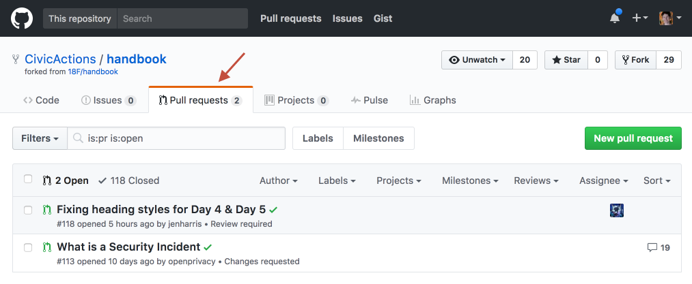
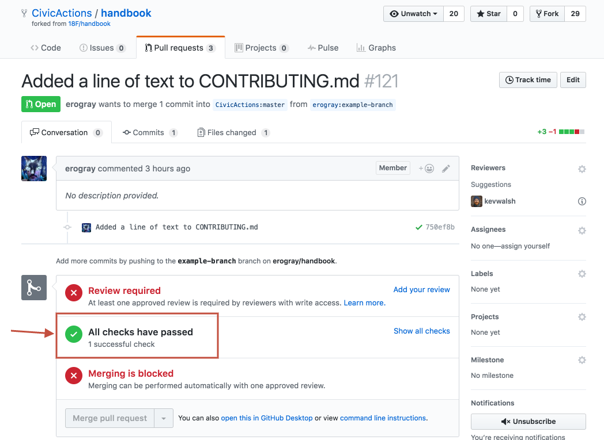
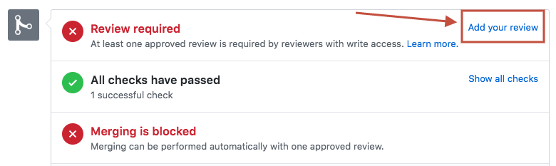
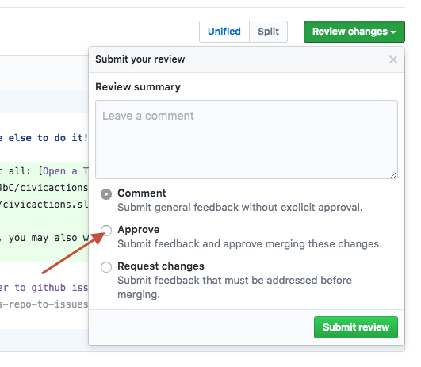
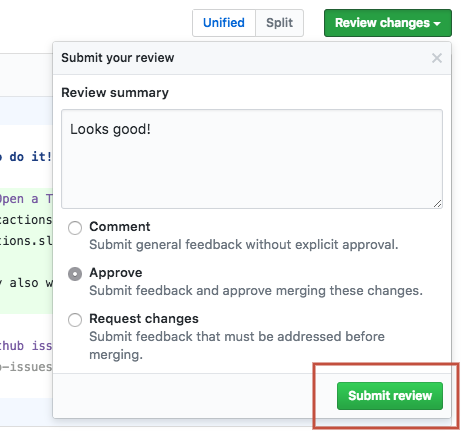
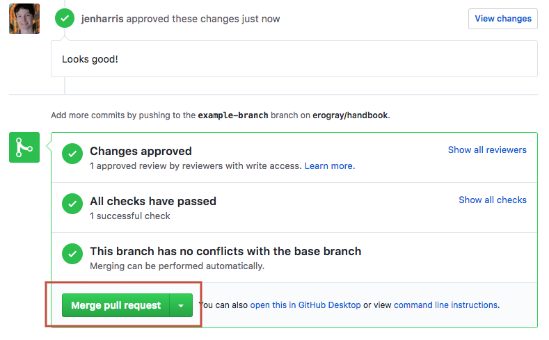

# Git

Git is a powerful version control tool that you can learn. At its core is the idea of cloning code, making changes, and merging those changes back in. In our case, those changes get merged back in after a "pull request" containing those changes gets made, reviewed, and accepted.

Git is confusing at first, but our handbook is a great place to learn Git because we use a relatively simple Git workflow, compared to many engineering projects.

In this project, The "master" branch is the active branch, with the latest, approved changes, published at [Read The Docs](read-the-docs.md). If you use Workflow 1, you'll be editing the branch directly, but

## Workflow 1: The easy way, via the GitHub UI on the master branch

We recommend this approach for those who are not already familiar with the Git workflow, and who do not have tools for keeping their GitHub forks up to date.

You'll need a GitHub account, and to be added to the CivicActions Team ([instructions are here](../04-how-we-work/tools/github.md)).

Go to a page, click edit, and make your changes, using [markdown](markdown.md). Before you commit your changes, click the "Preview changes" tab to make sure your formatting is good and everything looks right.

When you save it ("make a commit"), there are three fields to fill out. _All of these are optional_, with default values, and in most cases it's fine to leave the defaults.

- **The commit title**: By default it is something like "Update \[filename]". You can usually leave this as is (often this is ideal), or you can be more precise, but keep it short.
- **Extended description**: Explain your changes, if you wish. Useful if you need more than the 50 characters available in the title.
- **The branch name:** By default this will be a new branch, with a name like \[username]-patch-1. If you want to change it to something more semantic (eg \[username]-easy-github-contributing), that can be helpful to the reviewers, but it's not necessary.

After you commit, you will be asked if you want to create a new pull request with the branch you created. You'll again be presented with a few fields, which you can generally leave as is.

- **The PR title:** By default it is the title of your last commit.
- **Extended description:** This also draws from your last commit.
- **The right sidebar:** You can assign your pull request to someone on the team (someone you think may want to review your edits).

Most of the time you don't need to fill anything out, just click "Create pull request".

Or, if you want to make other changes on the same branch and have it reviewed at the same time as the commit you just made, don't create the PR quite yet. Navigate to the branch you created in your first commit (eg <https://github.com/CivicActions/handbook/tree/[your-branch-name]>. You can also find this branch from the handbook homepage by clicking on [branches](https://github.com/CivicActions/handbook/branches). Then, edit another file (or the same file you just edited) and commit it. This time, GitHub will know that you want to commit to the same branch as you created during your first commit.

Once you are done making commits to your branch, you can then create a PR from your branch to the master branch, which will include all changes.

## The more advanced way: fork the handbook

If you're familiar with the Git fork and pull request (PR) workflow, we definitely recommend forking this repo and making pull requests from your fork. This is the recommended way to contribute.

The easiest way to get started, if you're not familiar with the command line or an existing git repo management tool, is by installing [GitHub Desktop](https://desktop.github.com/), and then learning how to keep your fork up to date with the latest, create commits, and submit PRs.

You can use any other number of tools, including text editors (such as [Atom](https://atom.io/)) and the command line, or other GUI tools.

Resources:

- [Fork a Repo](https://help.github.com/articles/fork-a-repo/)
- [Working with Forks](https://help.github.com/articles/working-with-forks/)
- [Getting Started with GitHub Desktop](https://help.github.com/en/desktop/getting-started-with-github-desktop)
- [Contributing to Projects with GitHub Desktop](https://help.github.com/desktop/guides/contributing/)

## Assignment of pull requests

Your PR will automatically be assigned to a team for a review, based on which part of the handbook you are editing. That automatic review assignment is explained in [docs-governance.md](docs-governance.md). If you think that certain individuals on the team may have particular subject matter expertise or authority on the topic, you can also assign them directly via the "Reviewers" section of the right hand sidebar.

## How to review and merge pull requests

Each pull request must be reviewed by at least one other CivicActions employee before it can be merged.

Any CivicActions employee with GitHub account, who has been added to the CivicActions Team ([instructions are here](../04-how-we-work/tools/github.md)), can review a pull request and decide whether they feel confident about merging it. If it's not your area of expertise, ask somebody at CivicActions who has expertise in that area.

For example: if something looks like it's related to how Marketing works, ask a Marketing person to review it; if it looks like it needs Project Management team review, ask a PM.

If you're not sure if you should merge something, ask for a second opinion in [#docs](https://civicactions.slack.com/messages/docs/) first.

### Step-by-step instructions for reviewing, approving, and merging PRs:

1. Navigate to the open pull request. You can get there by clicking on the PR link if you have it, or by clicking on the Pull Requests tab at the top of the Handbook repo page.

2. Check to make sure "All checks have passed." If not, ask the person who added the PR to fix any errors.

3. Click "Add your review."

4. Review the commits. If the changes look good, make sure you select "Approve." Otherwise, add your comments or request changes (merging on the PR will be blocked until you or another reviewer approves it).

5. Submit your review.

6. Merge Pull Request, and you're done!

