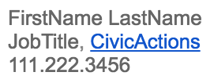

# New Hire Orientation Meetings

## Day 1

### Onboarding Paperwork
* Overview of [TriNet](https://sso.trinet.com/auth/cdcservlet?realm=sw_hrp&goto=https%3A%2F%2Fwww.hrpassport.com%3A443%2FLink2HR.eng%3F%2FSaf%2FEntry%2FPortal.htm&RequestID=22350&MajorVersion=1&MinorVersion=0&ProviderID=https%3A%2F%2Fwww.hrpassport.com%3A443%2Famagent%3FRealm%3D%2Fsw_hrp&IssueInstant=2017-06-13T15%3A05%3A16Z) tasks:
  * Employment Agreement
  * Confidential Information Document
  * I-9 - Employment Eligibility Verification
  * W-4 - Federal Income Tax Withholding
  * Direct deposit form
  * Benefits selection
  * Anti-Harassment Training
* Review and acknowledge Conflict of Interest (COI) plan here [COI](https://docs.google.com/document/d/1JSvThcqIM8BSmIoAjUrNZPdx0wemMCiyrBRyChORfv0/edit)

### First Orientation
* Get started with Trello (30 minutes)
  * Introduction [video](https://www.youtube.com/watch?v=aaDf1RqeLfo&feature=youtu.be)
  * Getting started [guide](https://trello.com/guide)
  * "Use Trello like a Pro" [blog post](https://blog.trello.com/how-to-use-trello-like-a-pro)
  * Keyboard shortcuts are listed [here](https://trello.com/shortcuts) Or just use the “?” shortcut to bring up that page any time
* Introduction to the [mentoring program](mentoring-program.md)
* Where to [Direct Questions](../../02-about-us\general-contacts-and-listservs.md)
* Working hours expectations:
  * Flexibility
  * Have a general set schedule / core hours
  * Put appointments in your personal calendar
  * Ping slack if you're just going offline for a few
  * Basically let your team know when you're not free
  * Over communicate if you're going offline (vacation, lunch, appointment, etc)
  * Be at the pre-scheduled meetings & tell manager if you can't attend
  * Be able to get your work done within your timebox
  * We aim for the following billable utilization:
    * Split projects: 80% (32 hours / week)
    * Full time on one project: 85% (34 hours / week)
    * Also remember our 5% ProDev & CommPart commitments

### Time Tracking
* Read the [Harvest documentation](../../04-how-we-work\tools\harvest.md) on logging time (30 minutes)
* Review account in [harvest](../../04-how-we-work\tools\harvest.md) (15 minutes)
* Read the submitting [expenses process](../../04-how-we-work\tools\harvest.md) (15 minutes)
* How to log [onboarding time](../../04-how-we-work\tools\harvest.md)
* Logging Meetings as an [Engineer](../../04-how-we-work\tools\harvest.md) / [PM](../../04-how-we-work\tools\harvest.md)
* Explanation submission of [hours worked](../../04-how-we-work\tools\harvest.md)

### Communication tools
* Slack
* Google Apps
  * Email
  * Calendar
  * Introduction to how we use the calendar
  * Hangouts
  * Drive/Docs
* Telephone Use
* Download, setup, and review basic communication tools (1 hour)

### Get to know your Colleagues
Balance Scores
All hands call/Bluejeans
Review Org Chart (15 minutes)
Review Team Bios (1 hour)
Intro to pods/Pod-specific practices

Afternoon check-in with your onboarding manager

## Day 2

### Time Off and Scheduling
* Review vacation time / requests [policies](../../03-policies/benefits.md#pto) (1 hour)
* Do you have any pre-approved time off requests? (15 minutes)
  * Upon hire, did you already talk with Aaron, Owen, or Elizabeth about needing some dates off? If so, please make sure Judy is aware and then you mention them to your onboarding manager. There is still a formal request off procedure that you'll need to do so we make sure the right dates get documented & marked in the calendar. Your onboarding manager can walk you through that process.

* Review [CivicActions holiday schedule](../../03-policies/benefits.md#holidays) (15 minutes)
* Review & update [Resource Guru profile](../../04-how-we-work/tools/resource-guru.md#updatingprofile) (30 minutes)
* Review [Professional development & community participation](../../03-policies/prodev-community-participation.md) (30 minutes)

### Project Overview Info (part 1)
* Relevant Project Introductions
  * Connect new hire with appropriate person to walk through each project if it's not the onboarding manager
  * Discuss the project that the new team member will be introduced to.
  * Discuss: goals of the project, Product Owner, stakeholders, team members, technologies used, ticket review, project status
* Manager to introduce [Scrum Call structure](../../04-how-we-work/agile-baseline/02-process/practices/daily-scrum-calls.md)
* Intro to [Jira](../../04-how-we-work/tools/jira.md) and [Trello](../../04-how-we-work/tools/trello.md)
* Read about the [Gold Star Program](../../04-how-we-work/gold-star-program.md) (15 minutes)
* Watch Scrum training videos: Introduction to Scrum (1 hour)
  * [Scrum Training Series videos](http://scrumtrainingseries.com/)
  * [Scrum Methodology \(Same videos w additional text support\)](http://scrummethodology.com/)

### Virtual Workplace Basics
Review [Virtual Workplace Basics](../../04-how-we-work/virtual-workplace-basics.md):
* Starting and Ending a Day with a Remote Team
* Heading offline for short periods of time
* Tour our [Virtual Workspaces](https://trello.com/b/TJsUalpG/our-workspaces) (15 minutes)
* Talking Timezones
* Communication Best Practices

### Aligning Yourself with CivicActions
* Create email signature (15 minutes)
  * Create an email signature. Avoid curly comic-like fonts & keep it simple. Include your name, title/role, company (with link to our website), and (optionally) your phone number. See the image below.

    

* Update LinkedIn & social media accounts with CivicActions as company (30 minutes)
  * Update LinkedIn and [connect with coworkers](https://www.linkedin.com/company/54684)
  * Update your skills on LinkedIn
* Create a [drupal.org](https://register.drupal.org/user/register?destination=home) account (30 minutes)
* Introduction to copywriter / editor
* [Update resume into CivicActions template](../team-resume-instructions.md) (2 hours)
* [Write your CivicActions bio w photo](../civicactions-bio-instructions.md) (4 hours)

Afternoon check-in with your onboarding manager

## Day 3

> @todo [Add Day 3 Agenda](https://trello.com/c/zYHXzIpr/102-add-missing-orientation-meeting-agendas-to-orientation-meetings-md)

Morning Meeting with Onboarding Colleague
How to create a ticket/card
Story point estimating
Intro to pods/Pod-specific practices

Agile and Scrum at CivicActions: combination of videos, reading, and training (part 2)
CivicActions Agile (which includes intro to Agile Baseline)

Security for Everyone (2 hours) (with Fen?)
Review and Acknowledge Security Policy
Set up Lastpass
Set up TFA
Complete Security Checklist
Take PII online course

Afternoon check-in call

## Day 4

> @todo [Add Day 4 Agenda](https://trello.com/c/zYHXzIpr/102-add-missing-orientation-meeting-agendas-to-orientation-meetings-md)

## Day 5

> @todo [Add Day 5 Agenda](https://trello.com/c/zYHXzIpr/102-add-missing-orientation-meeting-agendas-to-orientation-meetings-md)
