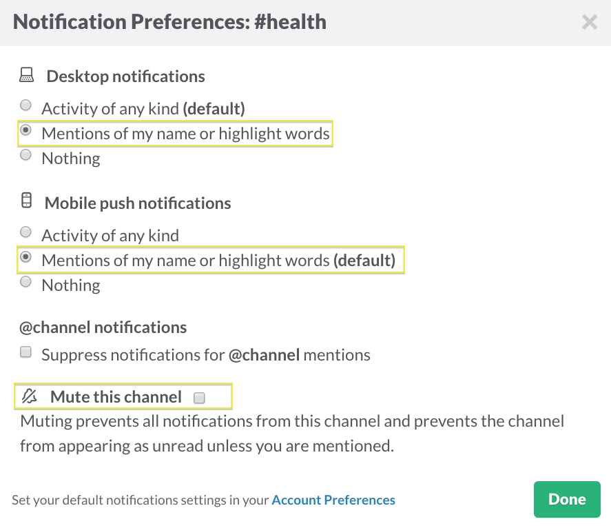
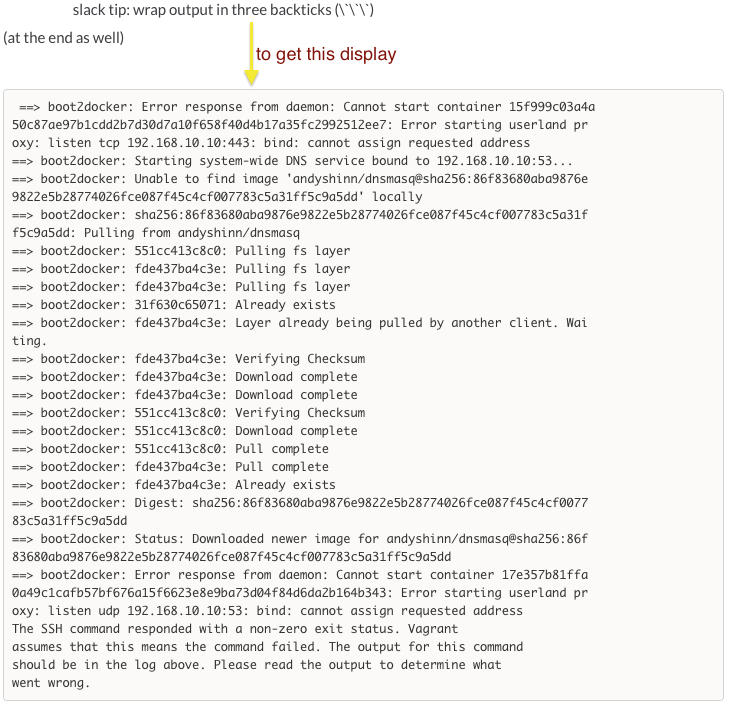
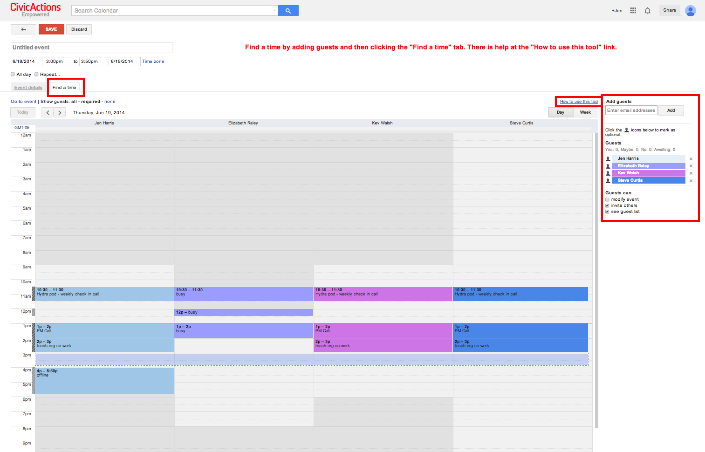
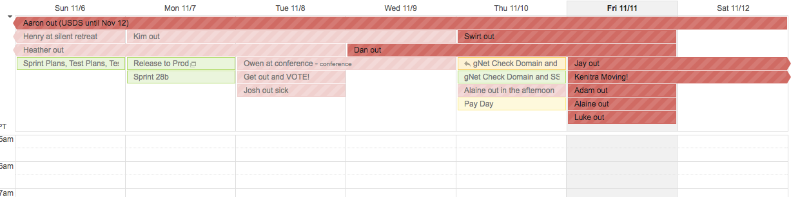
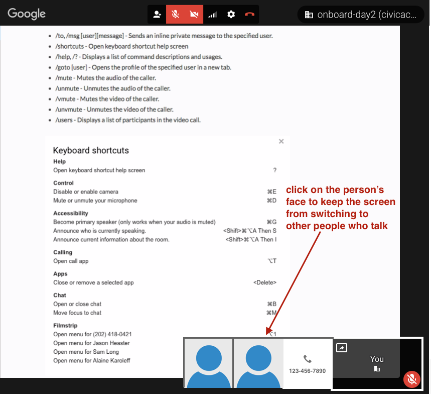
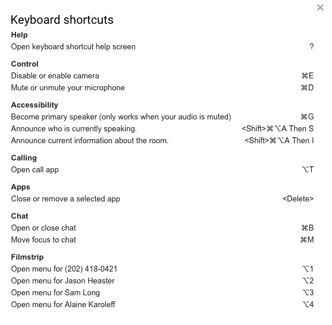
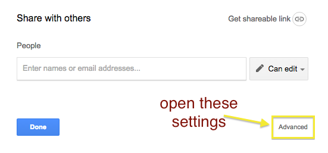
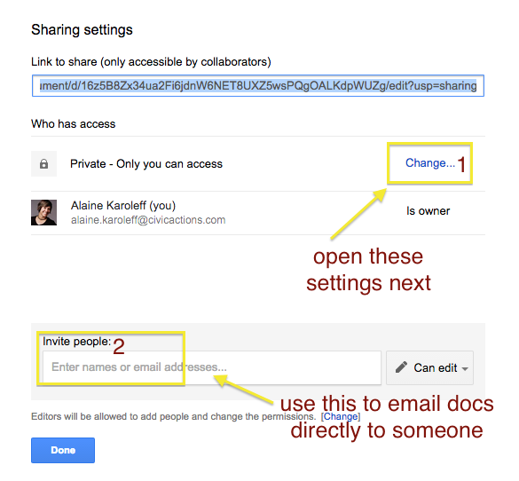

# Basic Communication Tools

## Slack

### Basics

* We use Slack for chatting with the team – whether as a whole, in smaller groups, or one on one.
* Ensure your status is set to "available" in Slack when online and free to chat, and "away" when not.
* Consider getting the Slack desktop app - either the native OS X / Windows one, or the Chrome app, which you can set up to run as a standalone app on system start up.
* Make sure to add a photo of yourself for your Slack avatar

### Channels

* Slack organizes communication into **channels**. A channel can be public, so that everyone can join, or private, so that messages are shared with only select individuals. Most project channels are private by default.
* We default to open, so when in doubt, message the group in a public channel instead of a direct message, or one-on-one.
* There are a wide variety of different channels you can join, from work-related to topic-related.
* Mandatory channels include: General, Announcements, Engineering or PM, your Pod, your project channels
* Recommended channels: how-we-work, random, sotd, qotd, gold-star, prodev
* The [Announcements channel](https://civicactions.slack.com/messages/announcements/details/) is for **announcements only**. All replies or conversation regarding announcements can transpire in the [General channel](https://civicactions.slack.com/messages/general/). Keeping announcements chatter to a minimum ensures that anyone who hasn't been paying attention to the General or other channels will be able to quickly locate important or not-to-be-missed information.

### Notifications

* To notify someone in particular, type **@name** with your message.
* If you want to call attention to everyone subscribed to channel, write **@channel** or **@group**.
* To alert only those in a channel/group who are online, write **@here**.

### Tips

* Consider using the word "ping" to check on the availability of someone
* Create a Google Hangout from Slack: type **/hangout** (will need to authorize the slack app in hangout too)
* To quickly bring back the last message you sent back to the text box, just press the Up arrow key.
* You can adjust notification preferences:
  
* Wrap your text in single asterisks for **bold**, underscores for *italics*, `grave accents` for code, and start the line with a > sign to make it a block quote. Formatting in Slack is similar to Markdown.
* To wrap single line output, use one pair of backticks ( `Your code here`). For multiple lines, wrap with three backticks (`Your code here. Some more code.`). 

### Further Reading

* [Formatting your messages](https://slack.zendesk.com/hc/en-us/articles/202288908-Formatting-your-message)
* [Creating a snippet](https://slack.zendesk.com/hc/en-us/articles/204145658-Creating-a-Snippet)

## Google Apps

### Email

#### Internal lists

* We use ca-team@lists.civicactions.net for all team wide communication, and important announcements (slack #announcements used often too)
* We use ca-employees@lists.civicactions.net for HR notices, etc. (it is generally low traffic)
* Other email lists: ca-\[functionalgroup] -sales, -dev, -team, etc.
* Every project has its own list as a way to overhear each other

#### Client and staff lists

* projectname@lists.civicactions.net (includes clients)
* projectname-int@lists.civicactions.net (just for CivicActions staff)

#### Protocol

To get someone's attention, put their name in all caps in subject. Or use "ALL" to get everyone's attention. For example:

* Subject: "RICHARD: are you around this afternoon?"
* Subject: "ALL: please update your hours by EOD"
* Subject: "URGENT: please update your hours by EOD"

#### Email Filters

Consider using [filters](https://support.google.com/mail/answer/6579?hl=en) to help manage you mail in preparation for quick archive.

### Google Calendar

#### Overview

**CivicActions uses shared calendars** in [Google Calendar](../../04-how-we-work/tools/basic-communication-tools.md#google-calendar) for CivicActions standing meetings, birthdays, and "out of office" time.

**You can specify which hours you work.** From the guide: "About a third of the way down the 'General' settings' page there's a section called 'Working hours' and a checkbox that's unchecked by default. If you check it, you can specify your preferred working hours. Once you save your changes, other people will get a warning if they try to schedule you outside those times."

**You can see other people's public calendars to help schedule meetings.** To view someone else's calendar, type their name in the lefthand column under "other calendars." Finally, there's a link titled "Find a time" (left of what's shown in the gif, below) which shows everyone's schedules next to each other so you can easily see when there are no conflicts.

**You can set up blocks of time that people can reserve.** Just select "Appointment slots" after you choose a window of time.

#### Best Practices

* Set your location, time zone and working hours (& keep them current) using calendar settings: 
* Always send invitations to <mailto:first.last@civicactions.com>
* Make sure your main <mailto:first.last@civicactions.com> calendar is at sharing at least free/busy with everyone in CivicActions
* Consider enabling "speedy meetings" (in Settings)
* Reply to meeting invitations (yes, no, maybe)
* Use the "optional" feature for attendees who are not required to attend
* Use the Find a Time feature:  feature to identify a meeting time where all required participants are free.
* Complete the Event Details section when creating an event
* If your event is related to a ticket, then include the ticket reference in the event title (i.e. a Jira RD-19 ticket event could be "Prototype Meeting RD-19")
* You can create a Hangout link from the event (actually, Hangout links, aka "video calls" are automatically generated when you create a new event)
* Add the Out of Office Calendar  calendar

### Google Hangouts

#### Overview
Google Hangouts are video chats in the browser. Here are some tips for using Hangouts:

* **You can add a Google Hangout to a meeting invite** by clicking "Add video call" on the event management page.
* **You can also start or share a hangout from Slack** by typing `/hangout`.
* **You can dial people into a Hangout.** A Hangout's "invite" dialog can generate a phone number that people can call.
* Use screensharing for demos and for pairing.

#### Best Practices

* Be on time - please! Every 10 seconds actually matters
* Add a photo to your account so it shows up in Hangout if your camera is off
* We use the chat and screensharing features often
* Turn off your camera or reduce bandwidth if connection is poor
* Use some kind of headset or headphones instead of relying solely on computer mic (computer mics can sometimes create echoes)
* Use proper etiquette for Hangout professionalism (consider the appropriateness of background visuals/noise, attire/dress, use of effects, eating, muting, etc.)
* It's okay to mute other each other
* We can invite people outside of CivicActions, too
* You can also use the Hangout to call people in via phone: 
* If you want to focus on just one participant (or their screen, if they're screensharing), you can stop the screen from switching by clicking on their picture/screenshare. To go back to automated switching, just click it again. 

#### Available Commands

* /to, /msg \[user]\[message] - Sends an inline private message to the specified user.
* /shortcuts - Open keyboard shortcut help screen
* /help, /? - Displays a list of command descriptions and usages.
* /goto \[user] - Opens the profile of the specified user in a new tab.
* /mute - Mutes the audio of the caller.
* /unmute - Unmutes the audio of the caller.
* /vmute - Mutes the video of the caller.
* /unvmute - Unmutes the video of the caller.
* /users - Displays a list of participants in the video call.

### Google Docs

* Google Docs allows you to create and share a variety of documents such as text documents, spreadsheets, presentations, and forms.
* Google Docs should be shared with your CivicActions email account
* If a link is shared with you, you can add yourself to the share list so you can reference it later on
* If you are using a template, always make a COPY
* Update default paragraph styles to match CivicActions standard styles when creating new docs to use/share
* If you create a document, make sure the whole team can find it and has access to it so you don't need to grant individual permissions

## Zoom

* We use [Zoom](https://zoom.us/) video conferencing software for larger meetings, such as our weekly and monthly All Hands Calls. To participate, you may download the Zoom app, view in browser, or call in from a telephone (just don't forget to mute yourself!).
* In the past we've also used [BlueJeans](https://www.bluejeans.com/).

## Telephone Use

* There are times when a phone call in may also be necessary, such as when wifi is not available or to call in to Zoom
* Don't rely on speaker feature, but have a headset handy
* You may need to be called into a Google Hangout if you can't attend the video meeting
* Sharing your phone number with the client/PO is optional
