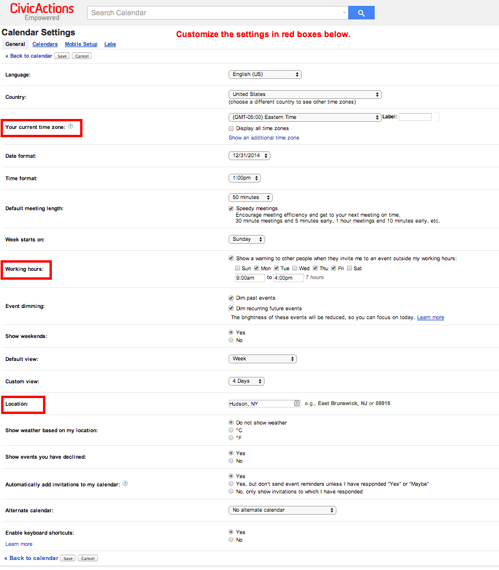
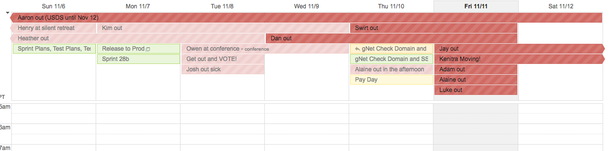

# Google calendar

## Overview

**CivicActions uses shared Google calendars** for CivicActions standing meetings, birthdays, and "out of office" time.

**You can specify which hours you work.** From the guide: "About a third of the way down the "General" settings' page there's a section called "Working hours" and a checkbox that's unchecked by default. If you check it, you can specify your preferred working hours. Once you save your changes, other people will get a warning if they try to schedule you outside those times."

**You can see other people's public calendars to help schedule meetings.** To view someone else's calendar, type their name in the left column under "other calendars." Finally, there's a link titled "Find a time" (left of what's shown in the gif, below) which shows everyone's schedules next to each other so you can easily see when there are no conflicts.

**You can set up blocks of time that people can reserve.** Just select "Appointment slots" after you choose a window of time.

## Best Practices

- Set your location, time zone and working hours (& keep them current) using calendar settings: 
- Always send invitations to <mailto:first.last@civicactions.com>
- Make sure your main <mailto:first.last@civicactions.com> calendar is at sharing at least free/busy with everyone in CivicActions
- Consider enabling "speedy meetings" (in Settings)
- Reply to meeting invitations (yes, no, maybe)
- Use the "optional" feature for attendees who are not required to attend
- Use the Find a Time feature:  feature to identify a meeting time where all required participants are free.
- Complete the Event Details section when creating an event
- If your event is related to a ticket, then include the ticket reference in the event title (i.e. a Jira RD-19 ticket event could be "Prototype Meeting RD-19")
- You can create a Hangout link from the event (actually, Hangout links, aka "video calls" are automatically generated when you create a new event)
- Add the Out of Office Calendar  calendar
