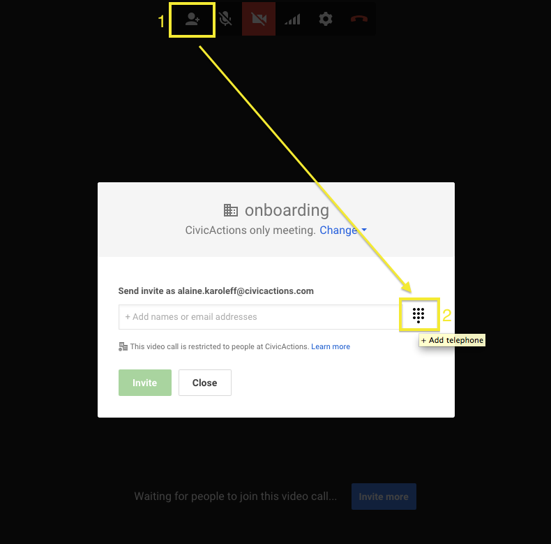
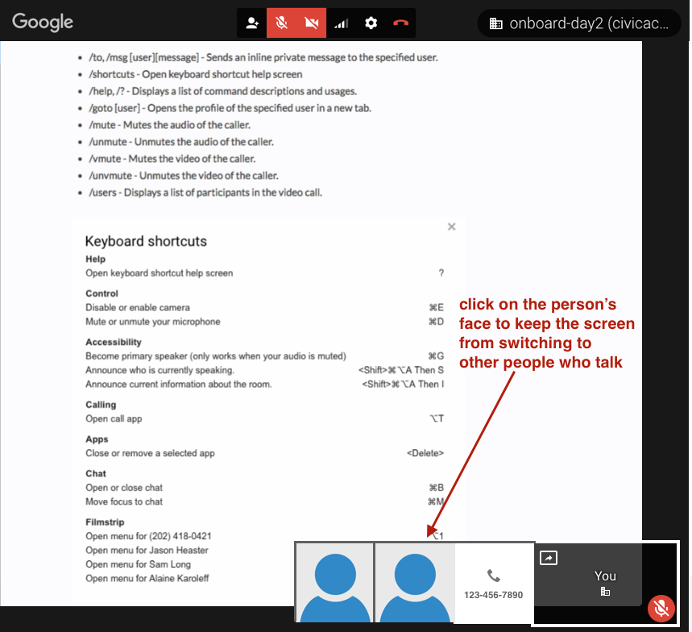

# Google Hangouts

## Overview

Google Hangouts are video chats in the browser. Here are some tips for using Hangouts:

- **You can add a Google Hangout to a meeting invite** by clicking "Add video call" on the event management page.
- **You can also start or share a hangout from Slack** by typing `/hangout`.
- **You can dial people into a Hangout.** A Hangout's "invite" dialog can generate a phone number that people can call.
- Use screen sharing for demos and for pairing.

## Best Practices

- Be on time - please! Every 10 seconds actually matters
- Default to video on for all video meetings
- Add a photo to your account so it shows up in Hangout if your camera is off
- We use the chat and screen sharing features often
- Turn off your camera or reduce bandwidth if connection is poor
- Use some kind of headset or headphones instead of relying solely on computer mic (computer mics can sometimes create echoes)
- Use proper etiquette for Hangout professionalism (consider the appropriateness of background visuals/noise, attire/dress, use of effects, eating, muting, etc.)
- It's okay to mute others
- We can invite people outside of CivicActions
- You can also use the Hangout to call people in via phone: 
- If you want to focus on just one participant (or their screen, if they're screen sharing), you can stop the screen from switching by clicking on their picture/screenshare. To go back to automated switching, just click it again. 
- If someone hears an echo & you don't, then it's likely your computer creating the echo. Try using headphones or plugging them in again.

## Available Commands

- /to, /msg \[user]\[message] - Sends an inline private message to the specified user.
- /shortcuts - Open keyboard shortcut help screen
- /help, /? - Displays a list of command descriptions and usages.
- /goto \[user] - Opens the profile of the specified user in a new tab.
- /mute - Mutes the audio of the caller.
- /unmute - Unmutes the audio of the caller.
- /vmute - Mutes the video of the caller.
- /unvmute - Unmutes the video of the caller.
- /users - Displays a list of participants in the video call.

