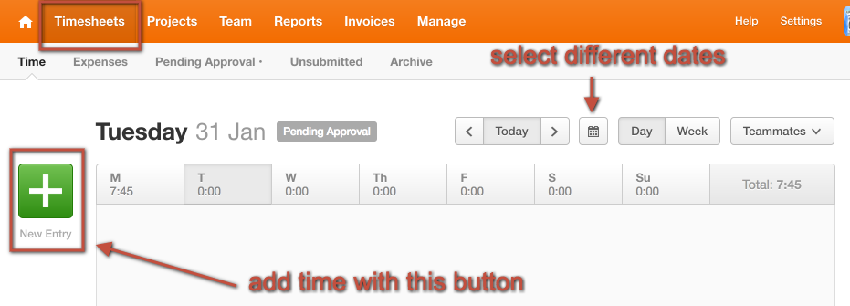
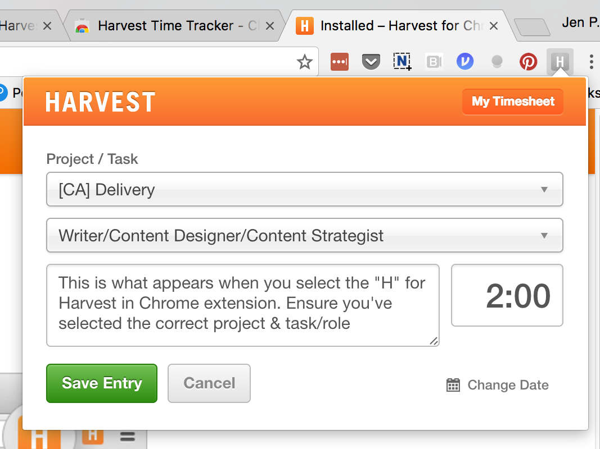
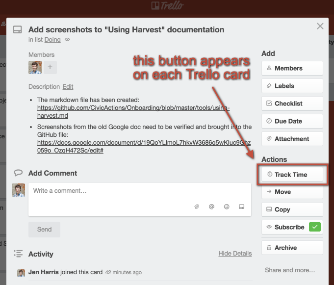
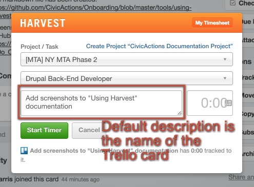
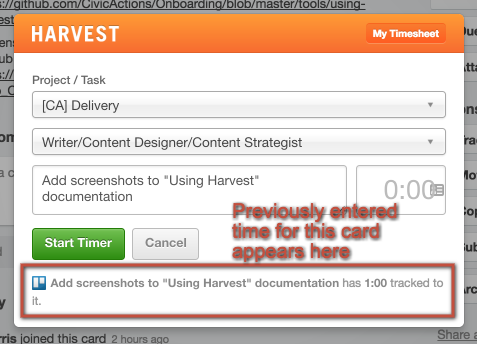
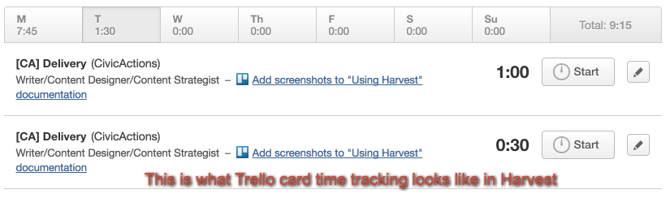
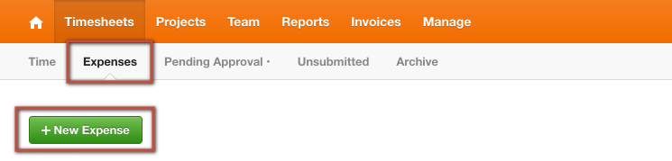
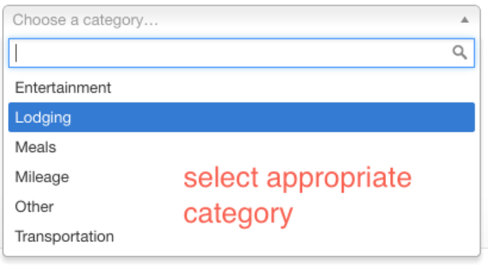
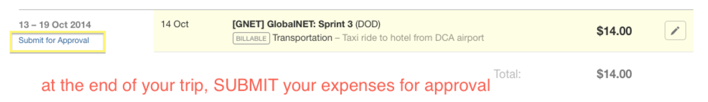

# Harvest

## Introduction

Harvest is an easy-to-use web app that allows us to track and allocate time and expenses for different projects. As an employee, you're responsible for reporting your own time and expenses. Time should be tracked daily and in appropriate categories. Optional approaches include Jira and Trello integrations and a mobile app.

## Update Your Account and Profile

Your Harvest login will be your email address: `first.last@civicactions.com`. Check your email for an invitation!
Then:

- Confirm that you can sign in to Harvest (<https://civicactions.harvestapp.com/>)
- Upload a photo of yourself
- Check to make sure that your time zone is correct
- If you know which project(s) you'll be working on, make sure that they're correct (or request updates from your onboarding manager)

## Logging Time

### How to Enter Time

- You are expected to enter your times **daily** in Harvest
- Go to <https://civicactions.harvestapp.com/time>
- Put description of work in each entry and ensure that you've selected correct project and role
- Time billed to the client is in 15 min increments. It will automatically round in the reports, but you'll see actuals in your timesheet.
- Use your judgement if something took 2 minutes but another task took 10, then consider lumping them together (if they're the same project) to 15 minutes together
- If you use a time tracker, you do not need to round your hours up to 15 min intervals bc the report that gets run rounds it up for you. Although no harm if you do it manually still.
- You must enter your time _each day_ before you sign off for the day. Ideally time is tracked in real time, but must be entered by end of day.

### Logging Your Working Expectations

- A full time employee is slotted for a 40 hour work week
- Fixed price projects: If someone only worked 4 hours then that is what she should bill. If she works an 8 hour day, even if 2 hours were for CivicActions-related meetings or comms, she should bill it all to the fixed price project. She doesn't need to make up the 2 hours from today if she can get her tickets complete, but if she's going to fall behind then she should do her best to catch up.
- Fixed price projects: 100% (40 hours / week - this means you can bill your internal meetings, like pod calls, to the project)
- Time and Materials: 85-95% (34-38 hours / week)

### Projects with Service Area-Based Tasks

A lot of our internal time represents an investment in a service area, so we're going to track that time accordingly.

- CA > Practice Area Calls - use this for Engineering, UX, PM, DevOps, Diversity & Inclusion calls, etc.
- CA > Check-in Calls - use this for one-on-ones, like with your manager, or onboarding/mentoring
- CA > Documentation - use this for documenting
- CA > Professional Development
- CA > IT/IS
- CA > Community Participation
- Other ad hoc projects like CA > Help Desk

### Onboarding Time Entries

Log your time in the CivicActions project: CA > Onboarding > select your service area or "Company-wide" for areas like Sales > then enter a description like the below examples in the task description that includes the word _onboarding_.

- Onboarding Meeting
- Onboarding handbook and/or Trello board cards review
- Onboarding watching scrum videos
- Onboarding resume and bio work

### Projects with Generic Tasks

For some internal projects, we don't care about tracking our time by service area, and you won't see service area based tasks there.

- CA > All hands calls
- CA > Pod calls
- CA > Management
- CA > Time off

## Harvest Timer Options

- Mac: <https://www.getharvest.com/mac>
- Windows: <http://trackerr.co/>
- Linux: <https://github.com/lionheart/TimeTracker-Linux>
- Chrome: <https://chrome.google.com/webstore/detail/harvest-time-tracker/fbpiglieekigmkeebmeohkelfpjjlaia>
- Mac: <http://punch.fousa.be/>
- Per OWEN: wire <https://github.com/zenhob/hcl> up to your window manager, so it starts/stops timers automatically when you switch workspaces
- There are also Harvest plugins for Jira & Trello

## Jira Integration

The Harvest plugin in Jira is located along the right column of a ticket. Currently it does NOT update your time in the "Jira Time Tracking" section, but only logs time in Harvest from Jira.

You must add time to BOTH Harvest plugin & update the Time Tracking section in Jira.

## Trello Integration

The Trello integration will require that you install the Chrome extension found here: <https://www.getharvest.com/trello> You can then log time directly from Chrome, as well as Trello cards. You may need to refresh or log out/into Trello to see the "Track Time" action.

## Other Add-ons

- Harvest has some other plugins & add-ons found here: <https://www.getharvest.com/add-ons>

## Tracking Expenses

Track expenses in the Harvest Expense tracking section.

Before you incur or track expenses be sure to get approval as described in the [expense policy](../../03-policies/expenses.md).

Billable expenses are when a cost can be passed back through to the client. This is usually only the case when the client has an approved budget for travel or other costs. Your project manager will be able to answer questions per project if you are not sure about the cost being billable or not.

There are mobile apps that make this part of Harvest easy to use, if you'd like to try them:

- <https://www.getharvest.com/iphone>
- <https://www.getharvest.com/android>

Here is a [quick overview of the expenses feature in Harvest](https://www.getharvest.com/features/expenses).

Directions for submitting expenses:

1.  Select your project and category
2.  Enter a description
3.  Enter the amount in USD
4.  Attach a picture of your receipt to each entry
5.  Only mark "billable" if the expense will be invoiced back to a client
6.  Once all receipts are logged
    1.  Go to the [Expenses Trello board](https://trello.com/b/2b6lZZ2Q/expenses) and find your expense4 request card
    2.  Add a comment indicating the total amount that needs to be reimbursed
    3.  Move your card from the "Approved" column to the "Submitted" column - this lets Admin/Judy know these expenses are ready for reimbursement

## Tracking Time off

We track vacation, leave and sick time, and leave for employees in Harvest. There is oversight on this, but ultimately you are responsible for this accuracy. Time off will not negatively impact your billable hour percentage.

You do NOT need to log entries when the office is closed for a holiday.

**Project:** CivicActions > Time off

**Task:**

- Leave (maternity, paternity, medical leaves)
- Sick Time (unplanned time off)
- Vacation (a planned day off)

**Time:**

- 8 hours for a full day
- 4 hours for a half day

## Harvest Phone App

If you are often "on-the-go" consider downloading the Harvest App.

This is also great for (and almost required) for any onsite trips & conferences. It makes entering time easy, but also makes entering your expenses a snap. You can take a photo of your receipt right from the Harvest App - no more worries about losing that receipt or having to enter them all after your trip. It will also provide visibility on the total expense costs while traveling.

- <https://www.getharvest.com/android>
- <https://www.getharvest.com/iphone>
