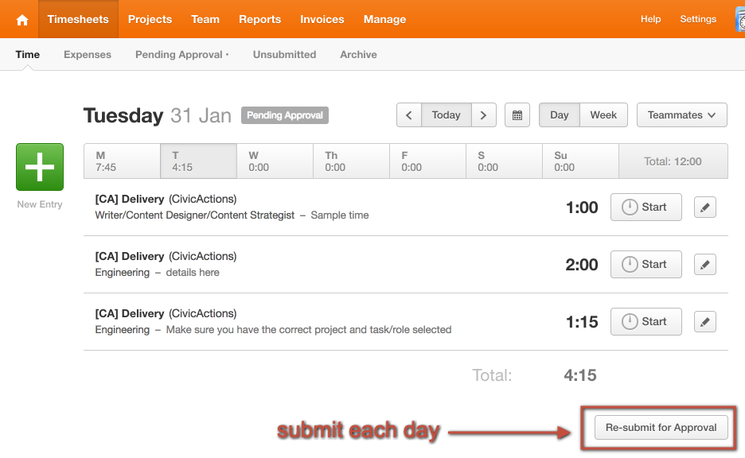
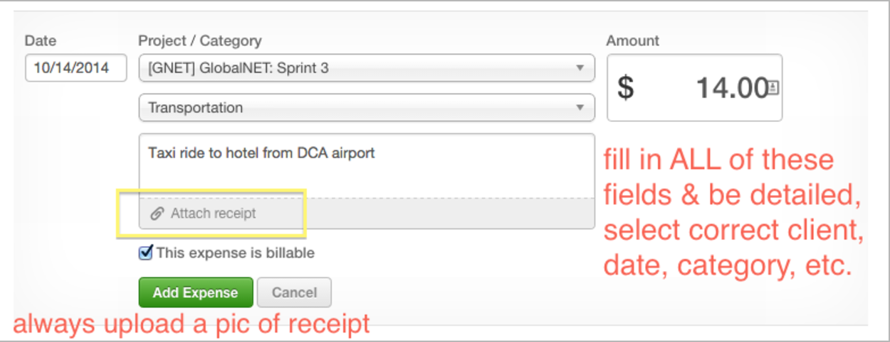
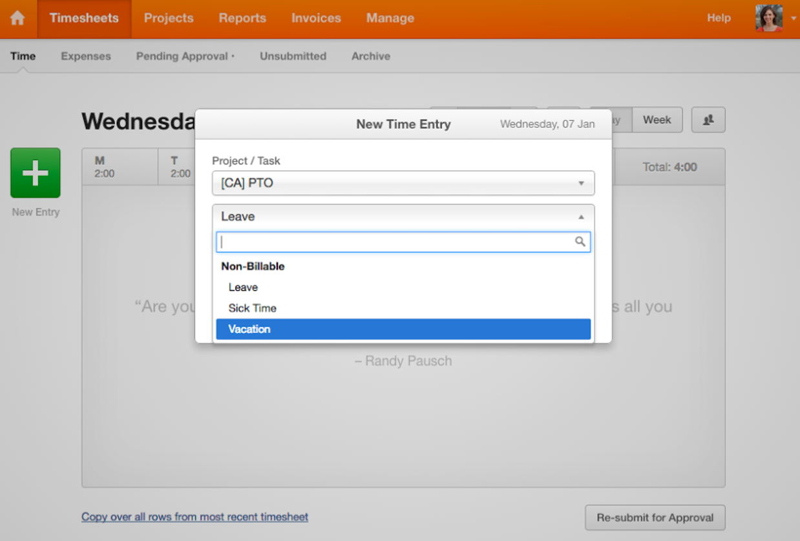

# Harvest

## Introduction

Harvest is an easy-to-use web app that allows us to track and allocate time and expenses for different projects. As an employee, you're responsible for reporting your own time and expenses. Time should be tracked daily and in appropriate categories. Optional approaches include Jira and Trello integrations and a mobile app.

## Update Your Profile

Your Harvest login will be your email address: <mailto:first.last@civicactions.com>. Check your email for an invitation!
Then:

* confirm that you can sign in to Harvest (<https://civicactions.harvestapp.com/>)
* upload a photo of yourself
* check to make sure that your time zone is correct
* if you know which project(s) you'll be working on, make sure that they're correct

## Logging Time

* If you're an engineer: CA > Delivery > Engineering
  * Types of meetings: All hands call, Bi-Weekly Engineering Meeting, Pod Calls, Monthly All Hands Call
  insert image
* If you're a Project Manager: CA > Delivery > Project Management
insert image
* Types of meetings: All hands call, Weekly Agile PM Meeting, Pod Calls, Monthly All Hands Call, Check-ins with team members on performance & balance, etc
insert image
* Onboarding
Enter a description like the below examples in the task description that includes the word "onboarding"
* Onboarding Meeting
* Onboarding handbook and/or trello board cards review
* Onboarding watching scrum videos
* Onboarding resume and bio work

## Submitting Your Timesheet

* Go to <https://civicactions.harvestapp.com/time>
* Submit your timesheet at the end of day on Monday
* For the remaining days in the week "re-submit" the timesheet EACH DAY
* Put description of work in each entry and ensure that you've selected correct project and role
* Track your time in increments of 15 minutes, rounded up per CivicActions protocol
  * If you use a time tracker, you do not need to round your hours up to 15 min intervals bc the report that gets run rounds it up for you. Although no harm if you do it manually still.
  * Time billed to the client is in 15 min increments. It will automatically round in the reports, but you'll see actuals in your timesheet.
  * Use your judgement if something took 2 minutes but another task took 10, then consider lumping them together (if they're the same project) to 15 minutes together
  * A full time employee is slotted for a 40 hour work week
  * Fixed price projects: If someone only worked 4 hours then that is what she should bill. If she works an 8 hour day, even if 2 hours were for civicactions related meetings or comms, she should bill it all to the fixed price project.  She doesn't need to make up the 2 hours from today if she can get her tickets complete, but if she's going to fall behind then she should do her best to catch up.

## Harvest Timer Options

* Mac: <https://www.getharvest.com/mac>
* Windows: <http://trackerr.co/>
* Linux: <https://github.com/lionheart/TimeTracker-Linux>
* Chrome: <https://chrome.google.com/webstore/detail/harvest-time-tracker/fbpiglieekigmkeebmeohkelfpjjlaia>
* Mac: <http://punch.fousa.be/>
* Per OWEN: wire <https://github.com/zenhob/hcl> up to your window manager, so it starts/stops timers automatically when you switch workspaces
* There are also Harvest plugins for Jira & Trello

## Jira Integration

The Harvest plugin in Jira is located along the right column of a ticket. Currently it does NOT update your time in the "Jira Time Tracking" section, but only logs time in Harvest from Jira.

You must add time to BOTH Harvest plugin & update the Time Tracking section in Jira.

## Trello Integration

The Trello integration will require that you install the Chrome extension found here: <https://www.getharvest.com/trello> You can then log time directly from Chrome, as well as Trello cards. You may need to refresh or log out/into Trello to see the "Track Time" action.

## Other Add-ons

* Harvest has some other plugins & add-ons found here: <https://www.getharvest.com/add-ons>

## Tracking Expenses

Track expenses in the Harvest Expense tracking section.

Except for professional development expenses of less than $50, all expenses should be approved by the relevant budget owner PRIOR to being incurred. E.G. Owen approves Delivery budget expenses, Bill approves Sales/Bizdev budget expenses and Aaron approves marketing expenses.

For any project or team onsites, your expenses are almost always reimbursable. Your project manager and Judy will provide information about what is or isn't reimbursable. For example, if you prefer first class for a flight, then that wouldn't be reimbursable but the amount for an economy class would.

There are mobile apps that make this part of Harvest easy to use, if you'd like to try them:

* <https://www.getharvest.com/iphone>
* <https://www.getharvest.com/android>

Here is a quick overview of the expenses feature in Harvest:

* <https://www.getharvest.com/features/expenses>
* A quick video of the Expenses section
* Review the screenshots from below for more direction
* Upload a picture of your receipt to each entry (required)
* Submit your expenses at the end of travel
* EMAIL Judy that you have expenses in Harvest for her review

## Tracking Paid Time Off (PTO)

We track vacation, leave and sick time and leave for employees in Harvest. There is oversight on this, but ultimately you are responsible for this accuracy. PTO will not negatively impact your billable hour percentage.

You do NOT need to log entries when the office is closed for Holiday

**Project:** CivicActions: PTO

**Task:**

* Leave (Maternity or Paternity leave)
* Sick Time (unplanned time off)
* Vacation (a planned day off)

**Time:**

* 8 hours if it's a full day
* 4 hours if it's a half day
* anything under 4 hours should not be recorded

## Harvest Phone App

If you are often "on-the-go" consider downloading the Harvest App.

This is also great for (and almost required) for any onsite trips you take. It makes entering time easy, but also it's makes entering your expenses a snap. You can take a photo of your receipt right from the Harvest App - no more worries about losing that receipt or having to enter them all after your trip.

* <https://www.getharvest.com/android>
* <https://www.getharvest.com/iphone>
