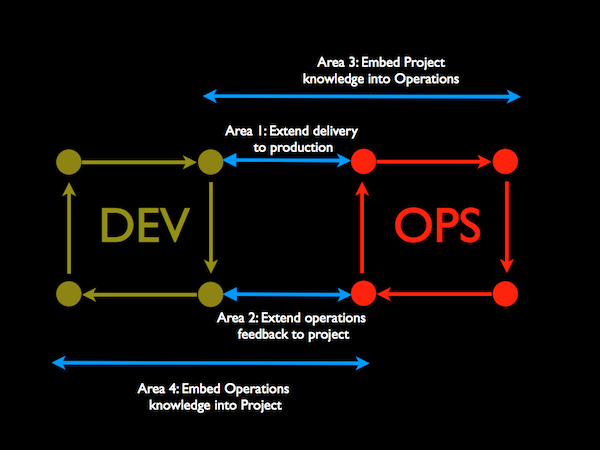

# Systems and Sandboxes

You can learn about our systems and sandboxes tool at the documentation for [Bowline](https://github.com/davenuman/bowline)

- We contemplate DevOps lite so that we influence greater harmony and integration between sandboxes and systems.

  

- We document our systems fully while avoiding too much verbosity.
