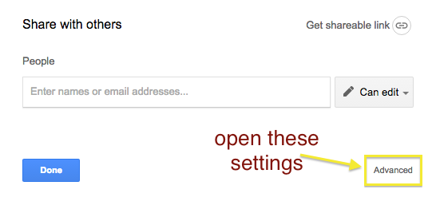
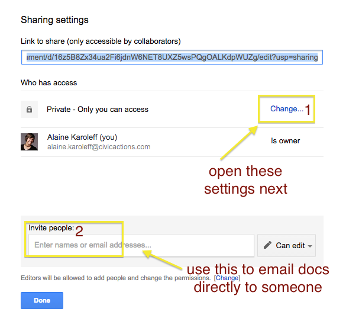
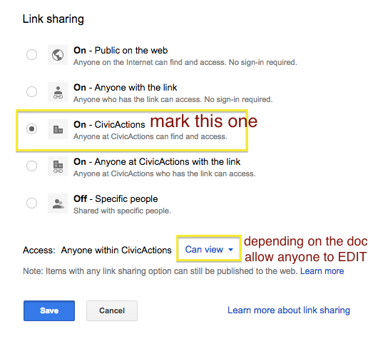

# Google Docs

- Google Docs allows you to create and share a variety of documents such as text documents, spreadsheets, presentations, and forms.
- Google Docs should be shared with your CivicActions email account
- If a link is shared with you, you can add yourself to the share list so you can reference it later on
- If you are using a template, always make a COPY
- Update [default paragraph styles](https://docs.google.com/document/d/1n1Jdu4vAnO0YCppo9YO2BkSYGyOqUCSJOrfrBBzBPBM/edit#) to match CivicActions standard styles when creating new docs to use/share
- When you create a document, set permissions so "anyone at CivicActions can find and access"
- Make sure to place documents & files in appropriate project folder instead of it living at your personal My Drive

