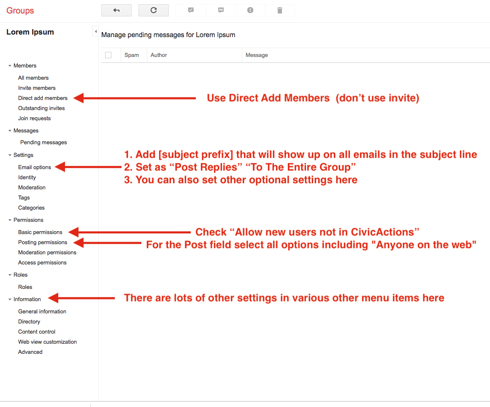

# Listserv Setup

We manage email lists via [Google Groups/Forum](https://groups.google.com/a/civicactions.net/forum/)

We use internal and client-facing listservs for email communication. PMs are responsible for setting up and maintaining project mailing lists.

## Naming conventions

- project@civicactions.com (includes clients)
- project-int@civicactions.com (just for CivicActions staff)

## Create a new project email list

- You need to be logged in using your civicactions.com email address
- [Create a group](https://groups.google.com/a/civicactions.net/forum/#!creategroup)
- Leave the defaults, usually (read the options on that page, it's pretty self-explanatory)

## Before adding users

- Under Basic Permissions: Check off "Allow new users not in civicactions".
- Under Posting Permissions: For the Post field select all options including "Anyone on the web" so that clients can email to the list and the list can be CC'd on other's emails.
- Under Email Options: Add \[subject prefix] that will show up in all emails in the subject line
- Under Email Options: Set "Post replies" "To the entire group" (in most cases)
- Under Email Options: You can set auto-replies, custom footers, etc.
- There are lots of other settings under other menu items.

## Adding users

- In most cases, you'll want to use "Direct add members" instead of "Invite members", so that invitees don't need to take any action.
- You can set a welcome message that should be sticky for future members that get added.
- Add elizabeth.raley@civicactions.com and owen.barton@civicactions.com to every list you create.

