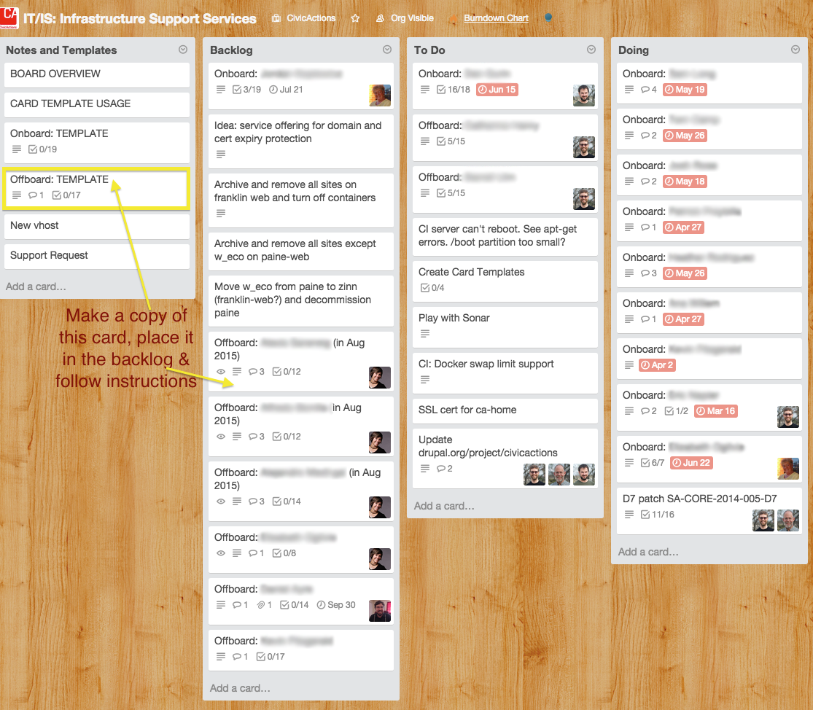

# Offboarding a Contractor from a Project

When offboarding a contractor from a project:

*   The Project Manager should use an "Offboard Card" after the contractor's work is completed to ensure the contractor is properly removed from CivicActions tools, files, and the project. An offboard card template is [here](https://trello.com/c/sXpzezNI/60-offboard-template) (prepare this card at the time of contractor hire so you can track all tools to which they are added).
*   At a minimum, you will need to remove the contractor from:
*   All Google Docs tow which they have access
*   All Trello boards
*   Any misc tools: Slack, Jira, MyBalsamiq, etc.
*   Any recurring or future calendar invites
*   The Project Manager should coordinate the Offboarding ticket with an engineer on the [IT/IS board](https://trello.com/b/zgRgVkvs/it-is-infrastructure-support-services) to ensure that the remainder of the tasks are completed.
*   Hold an exit interview with the contractor and send a follow up email to the contractor with notes from the interview.

