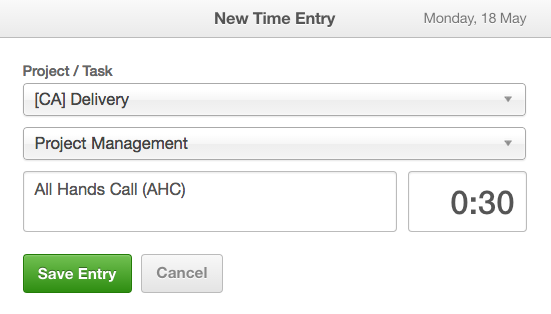
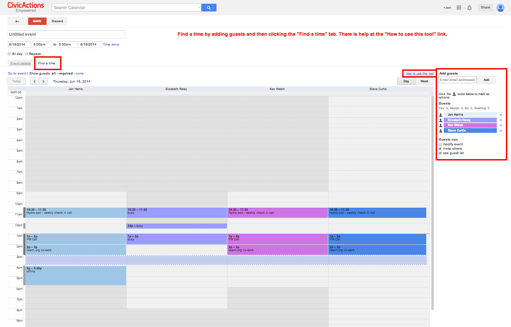

# Project Manager Training

Review [The Project Manager Role](pm-role.md) for an overview of PM responsibilities at CivicActions.

## New PM Instructions

* New PMs should shadow other PMs calls, meetings, scrums, retrospectives, sprint demos, kick-offs, etc.
* New PMs to know how to react if someone calls on them unexpectedly, and how to quickly move along the meeting and get it back on track. The new PM should have a quick checkin like *"No project checkin. Here observing. Balance 8. I'll pass to Steve"*
* New PM can practice taking meeting notes so they can compare their own notes from a meeting to the notes the PM actually shares with the team & client. New PMs can also take notes while current PM is still running meetings.

## Current PM Instructions

* All current PMs to look at their schedules and send invites to new PMs
* Current PMs to explain expectations of new PM roles on shadowing calls
* Current PMs to explain to team the role of the new PM on the calls (generally just observing and shouldn't be called upon unless they are actually part of that project)
* Current PMs to supply note templates should they exist (*ie scrum note template*)

## Shadowing Calls

* PMs to shadow other PMs calls, meetings, scrums, retrospectives, sprint demos, kick-offs, etc.
* All current PMs to look at their schedules and send invites to new PMs
* Current PMs to explain expectations of new PM roles on shadowing calls
* Current PMs to explain to team the role of the new PM on the calls (generally just observing and shouldn't be called upon unless they are actually part of that project)
* New PMs to know how to react if someone calls on them unexpectedly, and how to quickly move along the meeting and get it back on track. The new PM should have a quick checkin like *"No project checkin. Here observing. Balance 8. I'll pass to Steve"*
* Current PMs to supply note templates should they exist (*ie scrum note template*)
* New PM can practice taking meeting notes so they can compare their own notes from a meeting to the notes the PM actually shares with the team & client.

## Logging Internal Meetings

For non-billable internal meetings, PMs should bill as CA > Delivery > Project Management.

### Common Internal Meetings

* All Hands Call
* Weekly Agile PM Meeting
* Pod Calls
* Monthly All Hands Call
* Check-ins with team members on performance & balance, etc

## Resourcing

We use [Harvest Forecast](https://forecastapp.com/615047/schedule/projects) for documenting which projects team members are on, as well as their availability.

For a team member whose time is split between projects, Forecast helps plan how much time should be allocated to each project.

## Scheduling Meetings

* The PM is generally the person to schedule all scrum ceremonies, client meetings, process meetings, and general team meetings. The team is also always welcomed to schedule one-off meetings for the internal team if they desire.
* Avoid scheduling meetings with blank descriptions in Google Calendar. Fill in a description/purpose for the meeting, link relevant documents, indicate the desired outcome, include an agenda, list discussion points, etc
* Make a relevant and detailed meeting title. Make it descriptive and concise.
* Only require the necessary people, make other invitees optional.
* Check the FIND TIME function in Google Calendar to make sure you're not double-booking someone - it is crucial that you look at other people's calendars.

## Timeboxing

* Consider turning on your clock's seconds so you can keep close eye on your timeboxes - You'll know if you have one minute or 5 seconds left. It helps!
* A role of the PM/ScrumMaster is to keep track of timeboxes by keeping communication on topic and moving efficiently.
* At the start of a meeting, announce the timebox for a meeting (any besides the 15 scrum) so the Scrum team knows how much meeting time to expect
* Divvy time up if you have multiple presenters and let each person know how much time they each have.
* Let folks know as a meeting progresses where timeboxes stand
* Thank people for their time commitments on longer meetings
* Have a timer handy - either an app or a physical one on your desk
* Acknowledge when the timebox has expired and make sure folks can stay longer if needed.

## Helping the teams estimate

Accurately estimating is one of the most difficult things to do. Developers should ask questions if necessary to gather information about a story and the anticipated tasks related prior to estimating. Once a proposed strategy for implementing a ticket is complete, estimating can begin. As many developers as possible will ideally estimate together and agree upon an estimate as a group. Planning poker may be used to prevent estimates from some developers from affecting the estimates of others. Sometimes an average of the estimates is taken. Other times a conversation might ensue justifying a higher or lower estimate.

### Additional Resources

* <http://scrumtrainingseries.com/SprintPlanningMeeting/SprintPlanningMeeting.htm>
* <https://www.planningpoker.com/>

## Project Documentation

* Read ALL project documentation supplied by client
* Comprehend & ask questions about SoW & Contract
* Know what deliverables the project requires

## Typical PM Project Deliverables

* Burn down and/or burn up reports
* Hours reports
* Monthly status
* Sprint plans
* Monthly deliverables
* Quarterly deliverables
* Integrated project plan (IPP)
* Release notes

## PM Tools

* [Harvest Forecast](../04-how-we-work/tools/harvest-forecast.md)
* [Harvest](../04-how-we-work/tools/harvest.md)
* [Jira](../04-how-we-work/tools/jira.md)
* [Trello](../04-how-we-work/tools/trello.md)
* [GitHub](../04-how-we-work/tools/github.md)/Waffle
* Burndown charts
* [Google Docs/Folders](../04-how-we-work/tools/basic-communication-tools.md#google-docs)
* [Slack](../04-how-we-work/tools/basic-communication-tools.md#slack) (client-facing and internal channels)
