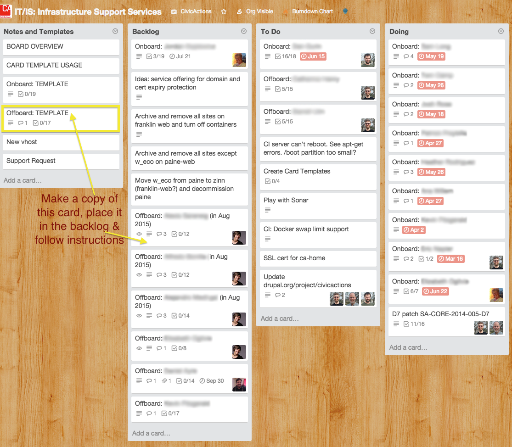

# Offboarding team members with legacy information who may return to consult

SCENARIO: Team member is leaving a project but will be retained as a “legacy consultant” for the active project team. (Assuming project does not require clearance and doesn’t handle sensitive data).

- Jira access - block if user limit is reached
- Git - no change
- Server - no change
- Site user accounts - no change
- SSH login - no change
- Slack - no change
- Email lists - no change
- Google Team drive - no change
- LastPass shares - no change
- Trello - no change
- UX tools - no change
- Calendar invites - remove or ask if they want to stay on any
- Audit accounts spreadsheet - update

# Offboarding team members who will not return to the project

SCENARIO: Team member finishes project work and probably won’t come back to project.
SCENARIO: Project requires security clearance and/or handles sensitive data and team member is “off” project

- Jira access - block
- Git - block
- Server - remove
- Site user accounts - block
- SSH login - remove
- Slack - remove from client channels & ask if they want to leave internal
- Email lists - remove
- Google Team drive - remove
- LastPass shares - remove
- Trello - no change
- UX tools - no change or block project
- Calendar invites - remove
- Audit accounts spreadsheet - update

# Offboarding a team member who leaves the company

SCENARIO: When this team member leaves the company they should be fully offboarded.

- Jira access - block
- Git - remove
- Server - remove
- Site user accounts - block
- SSH login - remove
- Slack - remove
- Email lists - remove
- Google Team Drive - remove
- LastPass shares - remove
- Trello - remove
- UX tools - remove
- Calendar invites - remove
- Audit accounts spreadsheet - update
- Manager to conduct exit interview and capture notes

- The Project Manager should use an "Offboard Card" after the contractor's work is completed to ensure the contractor is properly removed from CivicActions tools, files, and the project. An offboard card template is [here](https://trello.com/c/sXpzezNI/60-offboard-template) (prepare this card at the time of contractor hire so you can track all tools to which they are added).
- The Project Manager should coordinate the Offboarding card with an engineer on the [IT/IS board](https://trello.com/b/zgRgVkvs/it-is-infrastructure-support-services) to ensure that the remainder of the tasks are completed. See image below in contractor offboarding section.

# Offboarding a contractor from a project

SCENARIO: The contractor completes all project work/project ends they should be fully offboarded.

- Jira access - block
- Git - remove
- Server - remove
- Site user accounts - block
- SSH login - remove
- Slack - remove
- Email lists - remove
- Google Team Drive - remove
- LastPass shares - remove
- Trello - remove
- UX tools - remove
- Calendar invites - remove
- Audit accounts spreadsheet - update
- PM to conduct exit interview and capture notes

- The Project Manager should use an "Offboard Card" after the contractor's work is completed to ensure the contractor is properly removed from CivicActions tools, files, and the project. An offboard card template is [here](https://trello.com/c/sXpzezNI/60-offboard-template) (prepare this card at the time of contractor hire so you can track all tools to which they are added).
- The Project Manager should coordinate the Offboarding card with an engineer on the [IT/IS board](https://trello.com/b/zgRgVkvs/it-is-infrastructure-support-services) to ensure that the remainder of the tasks are completed.

