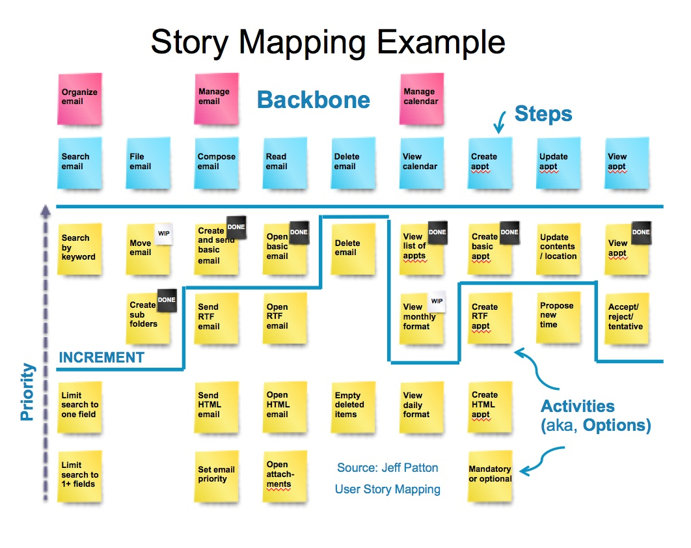

##Story Mapping Guide

**What it is:**

Story mapping is a way to tell stories and break them down into parts. It is a practice for talking about who does what, and why. It's a way to focus discussions around who will use the product and what they'll do with it later, after delivery. A story map can be used for planning development strategy and releases.

**Why to do it:**

"Story mapping keeps us focused on users and their experience, and the result is a better conversation, and ultimately a better product." (Jeff Patton)

- Story mapping helps to clarify overall project vision.
- Story mapping builds shared understanding about the whole product or feature experience.
- Story mapping can be used to break down big stories without losing track of the big picture.
- A story map can be used to prioritize based on outcomes, and to look at things holistically.
- A story map can be used to formulate a release strategy that focuses on specific users and outcomes.

**How to do it:**

If you have never participated in a story mapping practice before, we recommend that you watch the video and/or read the book linked under Recommended Reading below before you dive in.

Simply put, a story mapping practice is a series of conversations:

1. In the first conversation, you **frame the idea**: what is the big story of the product, feature, or service? What is it? Why are you building it?
2. Next, we need to **understand users**: who are they? What are their goals? (see [Audiences and Outcomes](audiences-and-outcomes-guide.md) for one specific method for answering these questions)
3. Finally, we **map use** of the product or feature from specific users' perspectives. Pretend the software has been delivered and shipped. Talk about a day in the life of the people using your product. Start from the beginning and write each step on a card. Sort the steps using the horizontal dimension of the map. Eventually, the map will describe the user's experience with the product or feature from end to end.
4. Use the vertical dimension of the map to **explore the details** of each step the users will take as they use the product or website. Capture the following, with words and pictures:
 - smaller steps
 - alternative steps
 - UI details
 - technical details

**Recommended Reading:**

Book: [_User Story Mapping_](http://shop.oreilly.com/product/0636920033851.do), by Jeff Patton

Video: [User Story Mapping with Jeff Patton](https://www.youtube.com/watch?v=AorAgSrHjKM) (1 hour 56 minutes; a formal talk Jeff gave in Germany, covering the same content as his book)

**Challenges and Tips for Distributed Teams:**

We currently use [Storiesonboard](https://civicactions.storiesonboard.com/) for remote story mapping.

**Examples:**

